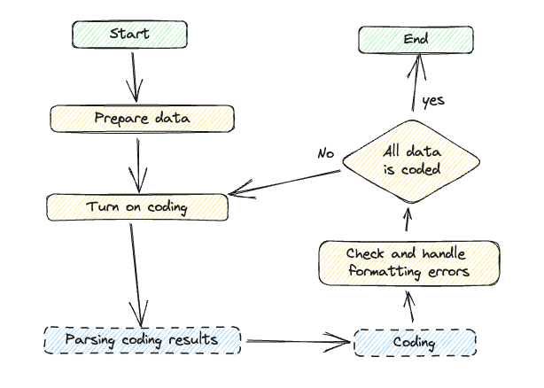

欢迎来到AICodingAssistant的文档!
===================================

.. **Lumache** (/lu'make/) is a Python library for cooks and food lovers
.. that creates recipes mixing random ingredients.
.. It pulls data from the `Open Food Facts database <https://world.openfoodfacts.org/>`_
.. and offers a *simple* and *intuitive* API.

.. Check out the :doc:`usage` section for further information, including
.. how to :ref:`installation` the project.

.. note::

   当前项目还在开发中，以后会提供更多的功能，敬请期待。

操作流程图
-----------------

1. **准备数据**: 
   准备数据，包括编码用的API_key，待编码的数据和编码规则。

   1.1 **API_key**: 
       从Open Food Facts申请API_key，用于获取食品数据。

   1.2 **待编码的数据**:
         待编码的数据格式如下表所示：

         1.2.1 **回帖数据**:

+------------+------------+-----------+
| 字段  | 类型  | 描述  |
+============+============+===========+
| index | int   | 待编码文本的唯一标识符，是回帖ID  |
+------------+------------+-----------+
| user_id | int   | 回帖的用户ID  |
+------------+------------+-----------+
| user_name | str   | 回帖的用户昵称  |
+------------+------------+-----------+
| reply_content | str   | 回帖内容  |
+------------+------------+-----------+
| topic_id | int   | 回帖的话题ID  |
+------------+------------+-----------+
| reply_id | int   | 回帖ID  |
+------------+------------+-----------+
| to_reply_id | int   | 回帖的父级回帖ID  |
+------------+------------+-----------+
| reason | str   | 编码理由，这一列可以空着  |
+------------+------------+-----------+

         1.2.2 **话题数据**:
         | 字段           | 类型  | 描述         |
         | -------------- | ----- | ------------ |
         | `topic_id`        | `int` | 话题ID         |
         | `topic_title`        | `str` | 话题标题         |
         | `topic_content`        | `str` | 话题内容，一半是话题的详细描述，这里可以空着         |

   1.3 **编码规则**:
         编码规则的数据格式如下表所示：
         | 字段           | 类型  | 描述         |
         | -------------- | ----- | ------------ |
         | `category`         | `str` | 编码分类     |
         | `code`        | `str` | 编码指标代码         |
         | `indicators`        | `str` | 编码指标        |
         | `example`        | `str` | 指标的示例（这一列可以不要）         |

2. **Turn on coding**: 
   Turn on coding, and the system will automatically code the data.

3. **Check and handle formatting errors**: 
   Check and handle formatting errors.

.. code-block:: console
   (.venv) $ pip install lumache

4. **All data is coded**: 
   All data is coded, and the coding is completed.
